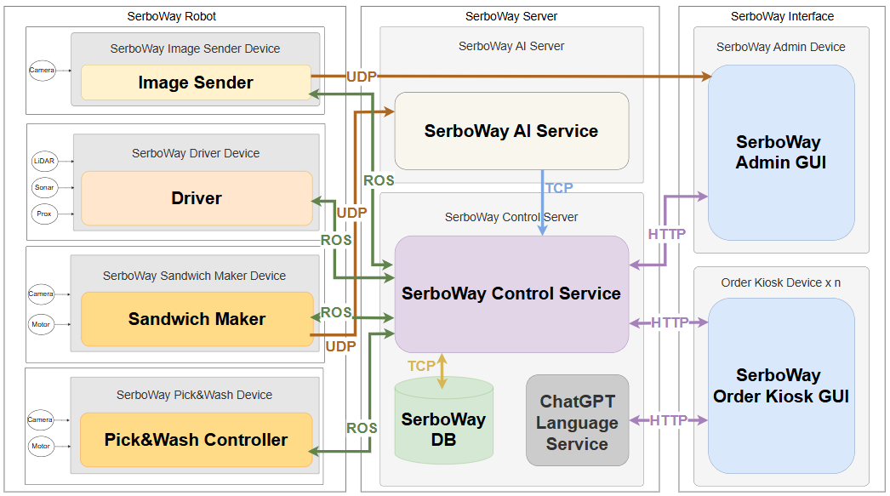

# 무인 샌드위치 제조 및 서빙 자동화 매장
-------------
## 프로젝트 소개
[발표자료](<https://docs.google.com/presentation/d/160QSe3YUKgoifGwZg-mb-uDF0cq3cOvPI7463plUZ20/edit?usp=sharing>)

 **최근 무인 매장 시장은 빠르게 성장하고 있습니다. 2024년 기준 약 85억 달러의 시장 가치를 기록한 바 있으며, 2033년까지 연평균 15.8%의 성장이 예상되어, 자동화 및 무인화 기술에 대한 수요가 지속적으로 증가하고 있습니다. 무인 매장 도입은 인건비 절감, 제품 품질의 균일성 확보 등 매장 운영의 효율성을 크게 높여줍니다. 또한, 음성 인식 및 키오스크 등 다양한 주문 방식을 통해 모든 연령층의 고객이 쉽고 편리하게 서비스를 이용할 수 있습니다. 본 프로젝트는 무인 샌드위치 자동화 매장을 구현함으로써, 미래형 매장 운영의 효율성과 소비자 만족도를 동시에 제고하고자 합니다**

-----------------
## 프로젝트 영상
> 이미지 누르면 유튜브로 이동합니다.

--------------

## 기술 스택
| 구분        | 내용                                                                 |
|-------------|---------------------------------------------------------------------|
| **개발 환경**   | Ubuntu 24.04, ROS2(Jazzy)                                           |
| **사용 언어**   | Python, C/C++                                                       |
| **개발 기술**   | MySQL, Open AI API, Langchain, OpenCV, PyQt                         |
| **하드웨어**    | Raspberry Pi 5, Arduino Nano, RFID                                  |
| **협업**       | Git, Jira, Confluence                                               |
| **통신**        | ROS, UDP, HTTP, TCP                                                |

----

## SW Architecture

------------

## 주요 기능

1. **주문(키오스크/음성)**  
  고객은 키오스크 터치 또는 음성 인식, 채팅을 통해 샌드위치를 주문할 수 있습니다. 주문 정보는 SerboWay Control Service로 전송되어 실시간으로 처리됩니다.

2. **제조(로봇팔)**  
  주문이 접수되면 로봇팔(Sandwich Maker)이 카메라와 색상 인식 기반 좌표 변환 기술을 통해 재료를 인식하고, 샌드위치를 자동으로 제조합니다. 제조 과정에서 재고 확인 및 알림 기능도 동작합니다.

3. **서빙(주행로봇)**  
  완성된 샌드위치는 주행로봇(Driver)이 최적 경로 생성 알고리즘(DFS 기반)을 통해 고객 테이블로 서빙합니다. 장애물 회피 및 자동 복귀 기능이 포함되어 있습니다.

4. **수거(빈그릇)**  
  고객이 식사를 마치고 빈 그릇 수거 요청을 하면, 주행로봇이 해당 테이블로 이동해 빈 그릇을 수거합니다. 빈 그릇 인식 및 위치 측정, 자동 수거 동작이 이루어집니다.

5. **관제(관리자 화면)**  
  관리자 전용 GUI에서 주문 현황, 로봇 상태, 재고, 판매 데이터 등을 실시간으로 확인하고, 시스템을 원격으로 제어할 수 있습니다. 관리자 인증, 데이터 열람, 로봇 상태 모니터링 등 다양한 기능이 제공됩니다.

## 주요 기술
1. **LLM 기반 음성 인식**
> Langchain Agent, OpenAI Whisper, GPT-4o, gTTS를 결합하여 음성 주문 시스템을 구축하였습니다. Whisper로 고객 음성을 텍스트로 변환하고, Langchain과 GPT-4o를 활용해 자연어 이해 및 주문 의도 파악, 메뉴 안내 메시지 생성을 처리합니다. gTTS로 안내 메시지를 자연스러운 음성으로 변환하여, 키오스크와 연동되는 음성 기반 주문 경험을 제공합니다.
2. **색상 인식 기반 좌표 변환**
> 카메라로 인식한 마커의 좌표를 변환행렬을 통해 로봇팔 좌표계로 변환합니다. HSV 색공간에서 특정 색상을 추출하고, 모폴로지 연산(잡음 제거 및 윤곽 강조)을 적용해 사각형 마커를 검출합니다. 이를 통해 재료의 위치를 정확하게 파악하고, 로봇팔이 해당 위치로 이동할 수 있도록 좌표를 변환합니다
3. **작업 할당**
> 메인 컨트롤 서버에서 주문 버퍼를 확인한 뒤, 로봇팔과 주행로봇의 상태 및 위치 정보를 바탕으로 작업을 동적으로 할당합니다. 샌드위치 제조, 서빙, 빈그릇 수거 등 각 작업별로 최적의 로봇을 선정하며, 효율적인 운영을 위해 작업 우선순위와 로봇 간 거리 등을 고려합니다.
4. **경로 생성 알고리즘**
> 맵의 꼭지점 마커를 기준으로 200x100 크기의 좌표계를 설정한 뒤, 주요 노드와 중간 노드를 생성합니다. 각 주행로봇은 DFS(깊이 우선 탐색) 알고리즘을 활용해 가능한 모든 경로를 탐색하고, 최단 경로를 선택해 샌드위치 배달 및 빈그릇 수거를 수행합니다. 장애물 감지 시 우선순위 기반의 회피 경로를 동적으로 생성하여 안전한 주행을 보장합니다.                                 

----

